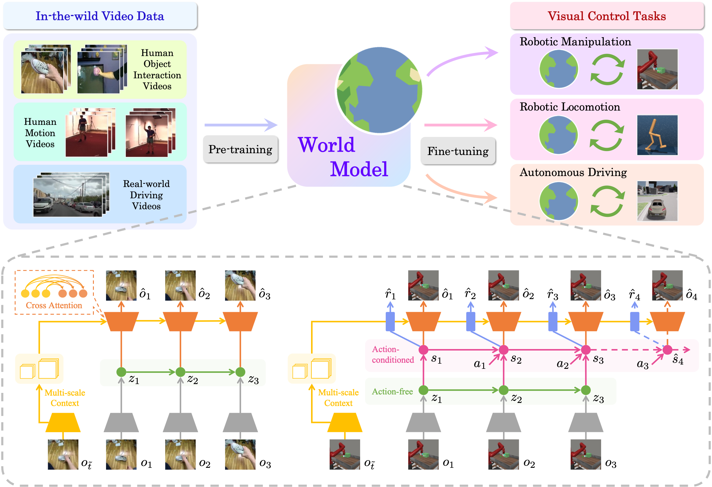

# Pre-training Contextualized World Models with In-the-wild Videos for Reinforcement Learning (NeurIPS 2023)

Official implementation of the [Contextualized World Models (ContextWM) with In-the-wild Pre-training from Videos (IPV)](https://arxiv.org/abs/2305.18499) in PyTorch. Unified implementations of [DreamerV2](https://github.com/danijar/dreamerv2) and [APV](https://github.com/younggyoseo/apv) in PyTorch are also included.

If you find our codebase useful for your research, please cite our paper as:

```
@inproceedings{wu2023pre,
  title={Pre-training Contextualized World Models with In-the-wild Videos for Reinforcement Learning},
  author={Jialong Wu and Haoyu Ma and Chaoyi Deng and Mingsheng Long},
  booktitle={Advances in Neural Information Processing Systems},
  year={2023}
}
```

## Method

**TL;DR**: We introduce Contextualized World Models (ContextWM), which utilize pre-training on in-the-wild videos to enable sample-efficient model-based RL of visual control tasks in various domains.

<div align="center"></div>

## Dependencies

The conda environment can be created by the following command:
```
conda env create -f environment.yaml
conda activate wmlib
```

**Meta-world**

Meta-world depends on [MuJoCo200](https://www.roboti.us/download.html). You may need to install it manually.
Meta-world itself can be installed using the following command:

```
pip install git+https://github.com/rlworkgroup/metaworld.git@a0009ed9a208ff9864a5c1368c04c273bb20dd06#egg=metaworld
```

**DMCR**

We adopt the original DMCR implementation provided by [QData](https://github.com/QData/dmc_remastered) and integrated it into our codebase. 
You need to additionally download the assets of DMCR from [here](https://github.com/QData/dmc_remastered/tree/main/dmc_remastered/assets) and move them to the `wmlib/envs/dmcr/assets` folder.

**CARLA**

We use CARLA 0.9.11 for our experiments. Please follow the [official instructions](https://carla.readthedocs.io/en/0.9.11/start_quickstart/) to install and run CARLA.
Note that we use the CARLA 0.9.8 version map of Town04, which is included in the `wmlib/envs/carla_api` folder. You should move this map to the CARLA 0.9.11 map folder (e.g., `CARLA_0.9.11/CarlaUE4/Content/Carla/Maps/OpenDrive`) to run the CARLA experiments.

An example of running a CARLA server:
```
./CarlaUE4.sh -fps=20 -carla-rpc-port={port to use} -carla-streaming-port=0
```
Before running the training script, you may need to add the CARLA Python API path and the CARLA egg file path to your `PYTHONPATH` environment variable:
```
export PYTHONPATH=$PYTHONPATH:{path to CARLA}/PythonAPI/
export PYTHONPATH=$PYTHONPATH:{path to CARLA}/PythonAPI/carla
export PYTHONPATH=$PYTHONPATH:{path to CARLA}/PythonAPI/carla/dist/carla-0.9.11-py3.7-linux-x86_64.egg
```

## Datasets


**Something-Something-V2 (*Recommended*)**

Download the [Something-Something-V2](https://developer.qualcomm.com/software/ai-datasets/something-something) dataset and extract frames of videos (Note that you should properly specify data paths in this script):

```
cd data/somethingv2
python extract_frames.py
```

Then you can generate data lists by the following command (also, properly specify data paths): 

```
python process_somethingv2.py
```

We have already included the generated lists in this repo (see `data/somethingv2/*.txt`).

**Human3.6M**

Download the processed Human3.6M dataset by [Pavlakos et al.](https://arxiv.org/abs/1611.07828) using [this script](./data/human36m/human36m.sh) and clip the frames to 64x64 using the following command (also, properly specify data paths):

```
cd data/human36m
python build_clip_dataset.py
```

Then you can generate data lists by the following command (also, properly specify data paths): 

```
python make_list.py
```

We have already included the generated lists in this repo (see `data/human36m/*.txt`).


**YouTubeDriving**

Download the [YouTubeDriving](https://github.com/metadriverse/ACO#dataset) dataset and preprocess the dataset (Note that you should properly specify data paths in this script):

```
cd data/ytb_driving
python make_list.py
```

We have already included the generated data lists in this repo (see `data/ytb_driving/*.txt`).


## Pre-trained Models

We provide our pre-trained world models:

- ContextWM pre-trained on Something-Something-V2 (*Recommended*), Human3.6M, YouTubeDriving, assembled three datasets, and [RLBench dataset from APV](https://drive.google.com/drive/folders/1Qk9fvC1OGxrbVFGm0zrPmAmV8lu4_l8D), respectively
- Plain WM pre-trained on Something-Something-V2

You can obtain them from [[Google Drive](https://drive.google.com/drive/folders/1nCTU-MZYS7ssxNusPX_k1XnhKdmrptgD?usp=share_link)] or [[Tsinghua Cloud](https://cloud.tsinghua.edu.cn/d/901049483a674e80b1e0/)].

## Experiments

### Pre-training from In-the-wild Videos

Run the following command to pre-train world models.

**Something-Something-V2**

```
python examples/train_apv_pretraining.py --logdir {save path} --configs something_pretrain contextualized --video_list train_video_folder --steps 1200000 --save_all_models True --video_dir {path to extracted video frames}
```

**Human3.6M**

```
python examples/train_apv_pretraining.py --logdir {save path} --configs human_pretrain contextualized --steps 1200000 --save_all_models True --video_dir {path to extracted video frames}
```

**YoutubeDriving**

```
python examples/train_apv_pretraining.py --logdir {save path} --configs ytb_pretrain contextualized --steps 1200000 --save_all_models True --video_dir {path to extracted video frames}
```

### Fine-tuning with Model-based RL 

Run the following commands to start model-based RL with pre-trained world models.

**Meta-world**

```
python examples/train_apv_finetuning.py --logdir {save path} --configs metaworld contextualized --task metaworld_{task, e.g. drawer_open} --seed 0 --loss_scales.reward 1.0 --loss_scales.aux_reward 1.0 --encoder_ctx.ctx_aug erasing --load_logdir {path to the pre-trained models}
```

Note that for the drawer open task, we find removing `--encoder_ctx.ctx_aug erasing` slightly improves the performance, thus we disable this option for our reported results of this task. All other Meta-world tasks enable this option.

**DMC Remastered**


```
python examples/train_apv_finetuning.py --logdir {save path} --configs dmc_remastered contextualized --task dmcr_{task, e.g. walker_run} --seed 0 --loss_scales.reward 1.0 --loss_scales.aux_reward 1.0 --load_logdir {path to the pre-trained models}
```
Note that you need to add `dmcr_hopper` to `--configs` when running the DMCR Hopper Stand task. The `dmcr_hopper` option fixes the camera's position, as we find it is too difficult for the agent to learn when the camera is randomly positioned and rotated in this task.

**CARLA**

```
python examples/train_apv_finetuning.py --logdir {save path} --configs carla contextualized --task carla_{task, e.g. ClearNoon} --seed 0 --loss_scales.reward 1.0 --loss_scales.aux_reward 1.0 --load_logdir {path to the pre-trained models} --carla_port {port number}
```
For each individual run, you need to start two CARLA servers with an interval of 10 for port numbers (e.g. 2030 and 2040) and pass the first port number to `--carla_port`.
The two servers are used for collecting data and evaluating the agent, respectively.

### DreamerV2 and APV Baselines

We include unified implementations for our baseline methods [DreamerV2](https://github.com/danijar/dreamerv2) and [APV](https://github.com/younggyoseo/apv), which can also be easily run by the following commands.

**DreamerV2**

```
python examples/train_dreamerv2.py --logdir {save path} --configs metaworld --task metaworld_{task, e.g. drawer_open} --seed 0
```

**APV**

```
python examples/train_apv_pretraining.py --logdir {save path} --configs something_pretrain plainresnet --video_list train_video_folder --steps 1200000 --save_all_models True --video_dir {path to extracted video frames}
```

```
python examples/train_apv_finetuning.py --logdir {save path} --configs metaworld plainresnet --task metaworld_{task, e.g. drawer_open} --seed 0 --load_logdir {path to the pre-trained models}
```

## Tips

Mixed precision is enabled by default, which is faster but can probably cause numerical instabilities. It is normal to encounter infinite gradient norms, and the training may be interrupted by `nan` values. You can pass `--precision 32` to disable mixed precision.

See also the tips available in [DreamerV2 repository](https://github.com/danijar/dreamerv2).

## Contact

If you have any questions, please contact wujialong0229@gmail.com .

## Acknowledgement

We sincerely appreciate the following github repos for their valuable code base we build upon:

- https://github.com/danijar/dreamerv2
- https://github.com/younggyoseo/apv
- https://github.com/esteveste/dreamerV2-pytorch
- https://github.com/QData/dmc_remastered
